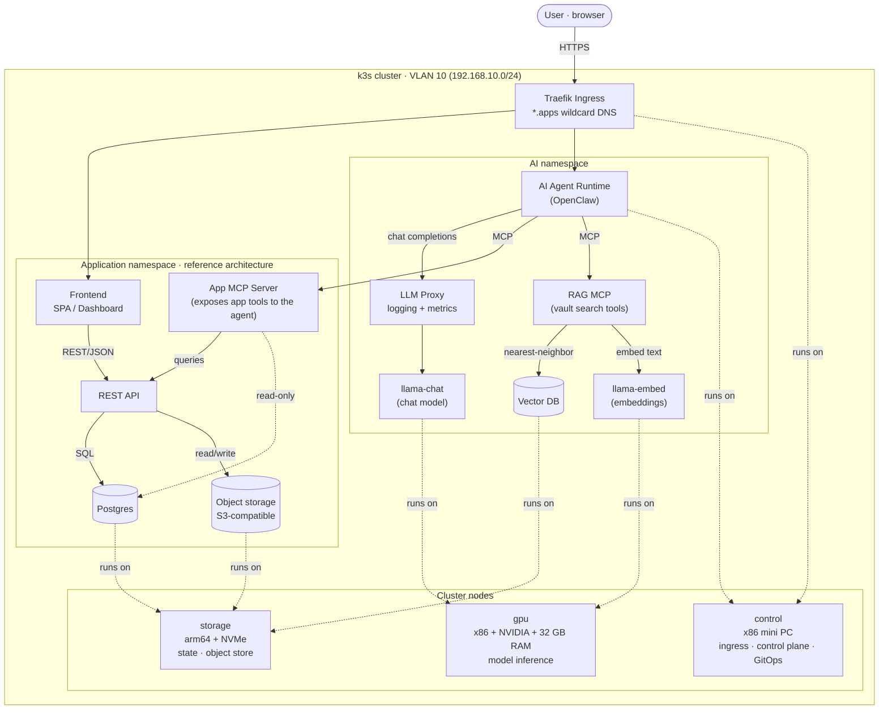

# Architecture

High-level view of the cluster, a generic application reference
architecture, and how applications expose themselves to the AI agent
through MCP.

## Layers

**Cluster + ingress.** Single VLAN, wildcard DNS funnels every app
hostname through Traefik. TLS terminates at the ingress; in-cluster
traffic is plaintext over the pod network.

**Application namespace (reference).** Any first-party app follows the
same shape: a frontend SPA served behind ingress, a REST API doing the
business logic, Postgres for relational state, and an S3-compatible
bucket for blobs. The fifth box — an **App MCP Server** — is the
generic pattern for letting the AI agent operate on the app: it speaks
the Model Context Protocol on one side and the app's own API/DB on the
other, so the agent gets typed, scoped tools instead of raw HTTP.

**AI namespace.** The agent runtime (OpenClaw) is the single integration
point. For inference it talks OpenAI-style chat completions through an
LLM proxy (which logs and meters every call) into a local llama.cpp
chat server. For *capability*, it speaks MCP outward — to a RAG MCP for
vault search and to one or more app MCP servers like the one in the
reference app. New capabilities ship as new MCP servers, not as code
changes inside the agent.

**Node substrate.** Three nodes, three roles. The control node carries
ingress, the k3s control plane, GitOps (Argo CD), and the agent
runtime. The GPU node is dedicated to model inference. The storage
node holds all the stateful services: Postgres, the object store, and
the vector DB live close to fast NVMe. The dashed edges in the diagram
show pod placement; everything else is scheduler-chosen.

## Why this shape

- **MCP as the integration boundary** keeps app code free of agent-
  specific glue, and lets the same agent runtime work against any
  number of apps without per-app forks.
- **One ingress, one VLAN, wildcard DNS** removes per-app DNS work — a
  new app gets a hostname for free.
- **Stateful services on one node** keeps backups and disk-affinity
  reasoning simple; if the storage node goes down, stateless workloads
  on the other two are unaffected and recover when state comes back.
- **GPU node single-purpose** means the inference server can size its
  resource block to the host without worrying about noisy neighbors.
